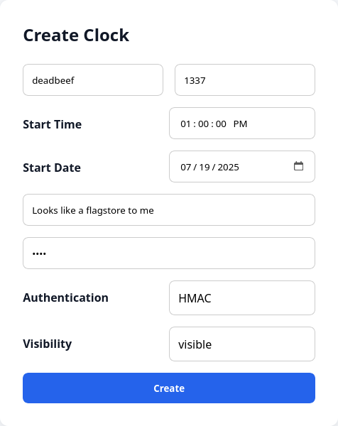
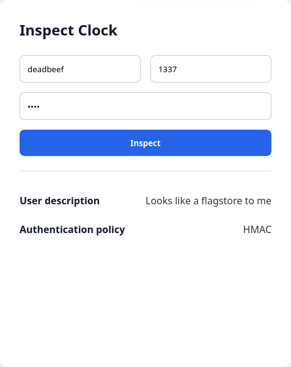
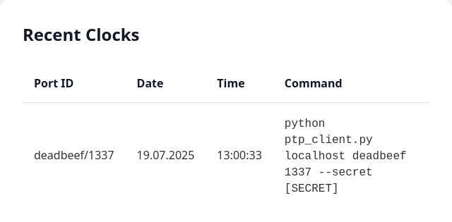

syncryn1z3 documentation
========================

## Table of Contents

1. [Introduction](#introduction)
   - [Idea](#idea)
   - [Languages](#languages) 
   - [Disclaimer](#disclaimer) 
2. [Installation](#installation)
3. [Features](#features)  
   - [Web Interface](#web-interface)
   - [Client App](#client-app)
4. [Flagstores](#flagstores)
5. [Vulnerabilities & Exploits](#vulnerabilities--exploits)  
   - [Return value leak](#1-return-value-leak)
   - [Buffer overflow](#2-buffer-overflow)
   - [Integer signed conversion](#3-integer-signed-conversion)
   - [Zero-length ICV](#4-zero-length-icv)
   - [Timing of strncmp calls](#5-timing-of-strncmp-calls)
6. [File Structure](#file-structure)

## Introduction

### Idea
The service is a custom implementation of the [IEEE 1588](https://ieeexplore.ieee.org/document/9120376) standard. The standard defines the Precision Time Protocol (PTP), that allows for very accurate clock synchronization over the network. With proper hardware support this allows for synchronization within a few nanoseconds. However, as it is only software based, this implementation cannot claim to be this accurate. The main focus was is to showcase a weird authentication protocol used by PTP as well as the dangers of high-resolution timestamps in secure applications.

The service is compliant with the standard whereever possible. Wireshark and tcpdump will correctly display and dissect the PTP messages sent out by the service.

### Languages
All of the vulnerable code is written in C. But some parts are shipped as binary to be reversed by the players. Other languages include CMake for the build system, Python for the client app and HTML/CSS/JS for the web interface.

### Disclaimer
The main network protocol used by this service is UDP. As UDP is a connectionless protocol, it will be more affected by an unrealiable network than TCP-based services. If you want to host this service, please ensure that packet loss will be minimal in your setup. To reduce the impact of packet loss on SLA, the checker is equipped with an automatic resend functionality.

## Installation

Clone the repository from GitHub.
```bash
git clone https://github.com/enowars/enowars9-service-syncryn1z3.git
cd enowars9-service-syncryn1z3
```

### Service
Run the service in a docker container.
```bash
cd checker
docker compose up --build -d
```

### Checker
Run the checker in a docker container.
```bash
cd checker
docker compose up --build -d
```

## Features

### Web Interface

A web interface was implemented to make interaction with the service more intuitive. The HTTP endpoint also is vulnerable, making some exploits more beginner friendly to find and automate. 



The first panel of the web interface allows the user to create a clock. The user *must* specify the following fields:
 - Clock ID: 64-bit hexadecimal number
 - Port: 16-bit decimal number

Additionally one may specify the following fields:
 - Start Time/Date upon creation the server will start the clock at the specified time and date
 - User Description: String containing up to 1500 bytes (used as flagstore)
 - Secret: Password that only allows numeric digits (0-9)
 - Authentication: Policy/method used by PTP protocol for login ("HMAC", "plaintext" and "none" are selectible)
 - Visibility: allow access via web interface

The "Authentication" and "Visibility" options exist to create separate flagstores.



The web interface also allows for retrieval of info about a clock. When specifying the clock ID and port with the correct secret, the user description and authentication policy is displayed. 



In order to make the web interface feel more alive, the most recently created clocks will be displayed on the "Recent Clocks" panel. It contains the ID and port of the clock as well as a rought time estimate. There is also a command-line string provided to allow for easy access to the clock via the client app.

### Client App

A Python/curses app is provided to showcase the clock synchronization. It also contains code snippets that make automating the exploits easier/feasible.

```
Welcome to the syncryn1z3 network clock inspector!

Connected to clock: deadbeef/1337
Description: Looks like a flagstore to me

Drift:
|                                       | -577 ppm
|                                       |
|**      *    *                  *      |
|     * *   *   *          *** *    *  *|
|  *** *       *                        |
|            *   **  *  **    *   *     |
|         **           *        *    ** |
|                   *              *    |
|                  *  *                 |
|                         *             |
+---------------------------------------+ -2226 ppm

Time: 19.07.2025 / 13:00:18:723654431
Press 'q' to quit.
```
When starting the client with the correct parameters, a graph with the clock drift to the remote server is displayed. It also displays the current time and user description of the selected clock.

## Flagstores
There exist three flagstores:
1. User description of clock accessible through Web UI
2. User description of clock secured by HMAC
3. User description of clock secured by plaintext secret

## Vulnerabilities & Exploits

### 1. Return value leak
#### Overview
- Flagstore: #1
- Difficulty: easy
- Replayable: no

#### Description
During secret verification, instead of a proper error code, the service leaks the return value of the `strncmp()` function. This is always the difference between the first non-matching bytes of the compared buffers.

#### Exploit
Start with a secret of all zeros. This will result in the server returning the first character of the secret. Now send the leaked character followed by zeros to leak the second character. This process is continued until the entire secret is known.

#### Fix
Instead of replying with the return value, send out a static error code.
```diff
diff --git a/service/src/http/tasks/http_tasks.c b/service/src/http/tasks/http_tasks.c
@@ -169,7 +169,7 @@
 static int http_handle_task_inspect_clock(struct http_state *state, struct http_
     if (entry->authentication_policy != PTP_AUTHENTICATION_POLICY_NONE) {
         ret = strncmp(entry->secret, json_string_get(secret_json), DB_SECRET_SIZE);
         if (ret) {
-            return http_send_error(session, ret, "Wrong secret");
+            return http_send_error(session, EPERM, "Wrong secret");
         }
     }
```

### 2. Buffer overflow
#### Overview
- Flagstore: #1
- Difficulty: medium
- Replayable: no

#### Description
Authentication policy is overridden by null-byte termination buffer overflow.

#### Exploit
When retrieving a clock from the DB, the contents of the relevant row are loaded into a DB cache (used to reduce redundant calls to the actual DB). The last member of the cache struct contains the clock secret. However the buffer does not have enough space to contain the null-byte termination of the string. The cache index can be deterministically computed. An attacker can use this to override the authentication policy of the next cache entry to zero. This will result in that entry being completely unsecured. A following request to the flagstore with any supplied secret will yield in flag retrieval.
Notably this also allows other teams to access the now unsecured flagstore. However it is possible for the attacking team to secure it again by writing over the cache entry containing the flag. This is not flag deletion, as the flag still exists in the persitent DB, and can be loaded into the cache again.  
```
Cache:
| Attacker controlled |          Flagstore          |
|     ...    | Secret | Authentication policy | ... |
```

#### Fix
Use `strncpy()` instead of `strcpy()`.
```diff
diff --git a/service/src/db/db.c b/service/src/db/db.c
@@ -124,7 +124,7 @@
 int db_get(struct db_state *state, struct db_entry **entry, struct ptp_decoded_p
     (*entry)->visible = sqlite3_column_int(statement, 2);
     (*entry)->user_description_length = sqlite3_column_int(statement, 4);
     memcpy((*entry)->user_description, sqlite3_column_blob(statement, 3), (*entry)->user_description_length);
-    strcpy((*entry)->secret, (const char *)sqlite3_column_text(statement, 5));
+    strncpy((*entry)->secret, (const char *)sqlite3_column_text(statement, 5), DB_SECRET_SIZE);
 
     ret = sqlite3_step(statement);
     if (ret != SQLITE_DONE) {
@@ -186,7 +186,7 @@
 int db_get_recent(struct db_state *state, struct db_entry **entries, short lengt
         entries[i]->visible = sqlite3_column_int(statement, 4);
         entries[i]->user_description_length = sqlite3_column_int(statement, 6);
         memcpy(entries[i]->user_description, sqlite3_column_blob(statement, 5), entries[i]->user_description_length);
-        strcpy(entries[i]->secret, (const char *)sqlite3_column_text(statement, 7));
+        strncpy(entries[i]->secret, (const char *)sqlite3_column_text(statement, 7), DB_SECRET_SIZE);
     }
 
     ret = 0;
```

### 3. Integer signed conversion
#### Overview
- Flagstore: #2
- Difficulty: medium
- Replayable: no

#### Description
During parsing of the binary PTP protocol, the length field is stored in a signed integer, even though it is transported as an unsigned integer.

#### Exploit
Send a (garbage) management frame to the target port_id. The server will return a management frame indicating an error that is signed with an authentication TLV. The signature is created with the same secret key used for authentication of clients. Also, the signature only covers part of the frame. The padding at the end the frame can be modified, without having to chnage the signature. The attacker can now insert a request TLV for the flag into the padding followed by a padding TLV with a negative length. The attacker can now send the packet back to the server. During parsing the valid authentication TLV will be duplicated due to the negative length. The following logic will therefore interpret the malicious request to be signed correctly and return the flag.
```
Server response:
| Header | Management TLV | Authentication TLV |             Padding TLV            |
<------------ Autheticated content ------------>

Altered request:
| Header | Management TLV | Authentication TLV | Malicius Padding TLV | Padding TLV |
                                                                      | Length: -XX |
                          <----------------- XX bytes ---------------->

Parsing result of altered request:
| Header | Management TLV | Authentication TLV | Malicius Padding TLV | Padding TLV | Authentication TLV (again) | ... |
<--------------------------------------------- Autheticated content --------------------------------------------->
```

#### Fix
Use unsigned integers instead of signed ones.
```diff
diff --git a/service/src/ptp/protocol/ptp_decoding.c b/service/src/ptp/protocol/ptp_decoding.c
@@ -277,7 +277,7 @@
 static int ptp_decode_tlv(struct ptp_decoded_tlv *output, uint8_t **input, uint8
     output->type = (enum ptp_tlv_type)be16toh(header->type);
     output->authenticated = false;
 
-    const short length = be16toh(header->length);
+    const unsigned short length = be16toh(header->length);
 
     head += sizeof(struct ptp_encoded_tlv_header);
     uint8_t *const tlv_tail = head + length;
```


### 4. Zero-length ICV
#### Overview
- Flagstore: #2
- Difficulty: easy
- Replayable: yes

#### Description
The ICV (HMAC) comparison uses the user-supplied length of the ICV.

#### Exploit
Send an authentication TLV with an ICV of length zero. This will cause the `memcmp()` function to return zero, resulting in a successful authentication.

#### Fix
Use a fixed value (i.e. 16 bytes) as length for ICV verification. 
```diff
diff --git a/service/src/ptp/security/ptp_security.c b/service/src/ptp/security/ptp_security.c
@@ -93,7 +112,8 @@
 static inline int ptp_check_icv_hmac_128(struct common_message_info *info, struc
     // Calculate ICV
     HMAC(EVP_sha256(), entry->secret, strnlen(entry->secret, PTP_PORT_SECRET_SIZE), data, data_length, icv_temp, &icv_length);
 
-    ret = memcmp(icv, icv_temp, tlv->icv_length);
+    // Compare 128 bits
+    ret = memcmp(icv, icv_temp, PTP_HMAC_128_SIZE); // In theory, this should also be a constant time comparison
     if (ret) {
         return -EPERM;
     }
```

### 5. Timing of strncmp calls
#### Overview
- Flagstore: #3
- Difficulty: hard
- Replayable: no

#### Description
The execution time of the `strncmp()` function used by the service varies depending on how much of the compared strings are matching.

#### Exploit
> The `strncmp()` function used by the service is defined in the libjson.so binary. This library used RWX-permissions to alter its own exported version of `strncmp()`, so that is takes 4096 cycles or ~0.9us @ 2.3GHz per character to execute. This was done to make the exploit feasible in an A/D CTF. 

Send an authentication TLV between two GET TIME management TLVs. This will leak quite accurate measurements of the strcmp function used to compare the supplied secret with the actual one. Repeat this for every possible character at a given position. Now take the character that had the longest execution time to leak the secret character by character.
Even though the time measurements are very accurate, the execution time is also subject to noise. A backtracking algorithm must therefore be used to detect faults.

#### Fix
Use a constant-time implementation of `strncmp()` (i.e. requires the same amount of time regardless of the content of the compared strings). It is feasible to write such a function during the CTF. However, some standard C-libaries come with such functions already builtin. In the scope of the CTF it is also feasible to just use the normal `strncmp()` function supplied by glibc though linker options. This would make the exploit require too many requests (to cancel out noise).
```diff
diff --git a/service/src/ptp/security/ptp_security.c b/service/src/ptp/security/ptp_security.c
@@ -14,6 +14,25 @@
 #define PTP_MAX_ICV_LENGTH 64
 #define PTP_HMAC_128_SIZE 16
 
+#pragma GCC push_options
+#pragma GCC optimize("O0")
+static int strncmp_const_time(const char *a, const char *b, size_t len) {
+    int ret = 0;
+    int not_done = -1;
+    
+    for (int i = 0; i < len; ++i) {
+        int compare = (int)*a - (int)*b;
+        ret ^= (~(!ret - 1) & compare) & not_done;
+        not_done &= (!(*a && *b) - 1);
+
+        ++a;
+        ++b;
+    }
+
+    return ret;
+}
+#pragma GCC pop_options
+
 static inline int ptp_compute_icv_none(struct ptp_decoded_authentication_tlv *tlv) {
     tlv->icv[0] = '\0';
```

## File Structure
Overview of the most important files/directories.

### Service
```
service
|── src
|   ├── common                  # Common types
|   ├── db                      # Interface to sqlite database / cache
|   ├── http                    # HTTP endpoint
|   |   └── tasks               # Web API message handling
|   ├── ptp                     # PTP protocol implementation
|   |   |── protocol            # PTP encoding/decoding functions
|   |   |── security            # Authentication functions
|   |   └── tasks               # PTP message handling
|   ├── udp                     # UDP endpoint
|   └── util                    # Various utilities
|── lib
|   ├── include                 # Headers
|   └── libjson.so              # JSON encoding/decoding library (contains slow strncmp function)
|── client                      # Python PTP client
|── static                      # Statically served content for the web interface
└── cleanup.py                  # Database cleanup script
```

### Checker
```
checker
└── src
    ├── checker.py              # Main checker code
    ├── bf.py                   # Utilities for custom brainfuck encoding
    ├── ptp_message.py          # Utilities for PTP message encoding/decoding
    ├── build.py                # Build script to compile C-based encode/decode functions
    └── protocol                # PTP encoding/decoding functions
```
